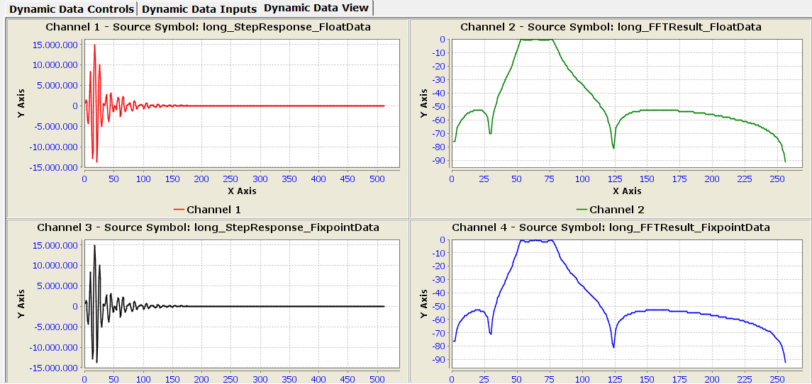

# FilterDesign

Digital IIR filter design in C. It computes coefficients for Butterworth, Chebyshev (type I) and
Cauer (elliptic) filters in lowpass, highpass, bandpass and bandstop form. It then tests them in
floating point and fixed point.

The project runs in the **MPLAB X Simulator** for the **PIC32MX795F512L**. The results (impulse
response and magnitude spectrum) are shown with the **DMCI** plugin.



## How it works

1. The corner frequencies are pre-warped with `tan(π·f/fs)` to compensate for the frequency
   distortion of the bilinear transform.
2. A normalized reference lowpass is designed from the tolerance scheme (passband ripple and
   stopband attenuation). This determines the filter order.
3. The reference lowpass is transformed into the requested type (LP, HP, BP, BS) as a cascade of
   analog second-order sections.
4. Each section is mapped to a digital biquad with the bilinear transform.
5. The biquads are converted into numerator/denominator arrays for `float` and for fixed point.

## Project structure

| Path | Content |
|---|---|
| `FilterDesign/filter_design.c/.h` | Filter design library (`FLD_*`) |
| `alg/filter_sos.c/.h` | Biquad cascade, direct form II, `float` and fixed point (`FLT_*`) |
| `alg/fft_float.c/.h`, `alg/complex_float.c/.h` | Radix-2 FFT and complex arithmetic (`FFT_*`, `CPLX_*`) |
| `alg/fft_long.c/.h` | Fixed-point FFT (not used by `main.c`) |
| `main.c` | Example: design, impulse response, FFT, conversion to dB for DMCI |
| `dsp_alg.X/` | MPLAB X project and DMCI configuration (`dmci_config.xml`) |

## Filter specification

| Field | Example | Meaning |
|---|---|---|
| `Samplerate` | 8000.0 | Sampling rate in Hz |
| `F1_Analog` … `F4_Analog` | 400 / 800 / 1200 / 1800 | Band edges in Hz, see table below |
| `ad_Passband_Attenuation` | 3.0 | Maximum passband attenuation (ripple) in dB |
| `as_Blocking_Attenuation` | 40.0 | Minimum stopband attenuation in dB |

What F1 to F4 mean depends on the filter type:

| Type | Passband edge(s) | Stopband edge(s) | Unused |
|---|---|---|---|
| Lowpass (`TP`) | F1 | F2 | F3, F4 |
| Highpass (`HP`) | F4 | F3 | F1, F2 |
| Bandpass (`BP`) | F2, F3 | F4 (upper only) | F1 |
| Bandstop (`BS`) | F1, F4 | F2, F3 | — |

## Usage

```c
DSP_DATA my_filter;

FLD_Set_Instance(&my_filter);           // 1. register the instance

my_filter.Samplerate = 8000.0;          // 2. set the specification
my_filter.F1_Analog  = 400.0;
my_filter.F2_Analog  = 800.0;
my_filter.F3_Analog  = 1200.0;
my_filter.F4_Analog  = 1800.0;
my_filter.as_Blocking_Attenuation = 40.0;
my_filter.ad_Passband_Attenuation = 3.0;

FLD_Frequency_Transformation();         // 3. pre-warp the frequencies
FLD_Init_Filter();                      // 4. reset the coefficients
FLD_BP_Cauer();                         // 5. design: exactly ONE FLD_<type>_<characteristic>()
FLD_Coefficient_Assignment();           // 6. analog sections -> digital biquads

FLD_InitCoeffsFloat(num, den, taps, my_filter.Sub_Filter);      // 7a. float coefficients
FLD_InitCoeffsFixpoint(lnum, lden, ltaps, my_filter.Sub_Filter); // 7b. fixed-point coefficients
```

These are the available design functions. `TP` is lowpass, the German *Tiefpass*.

|  | Butterworth | Chebyshev | Cauer |
|---|---|---|---|
| Lowpass | `FLD_TP_Butterworth` | `FLD_TP_Tschebycheff` | `FLD_TP_Cauer` |
| Highpass | `FLD_HP_Butterworth` | `FLD_HP_Tschebycheff` | `FLD_HP_Cauer` |
| Bandpass | `FLD_BP_Butterworth` | `FLD_BP_Tschebycheff` | `FLD_BP_Cauer` |
| Bandstop | `FLD_BS_Butterworth` | `FLD_BS_Tschebycheff` | `FLD_BS_Cauer` |

`my_filter.n_Order` gives the resulting filter order, and `my_filter.Sub_Filter` gives the number
of biquads. Each biquad uses three entries in each array (`den[0]` is always 1), so the arrays
need `3 × Sub_Filter` elements. Up to 16 biquads are supported.

Filter one sample at a time:

```c
float y  = FLT_float_sos(den, num, taps, x, my_filter.Sub_Filter);
long  yq = FLT_long_sos(lden, lnum, ltaps, xq, my_filter.Sub_Filter);
```

### Fixed-point format

`INTEGER_PRECISION` in `FilterDesign/filter_design.h` sets the number of fractional bits. The
default of 27 gives Q27 in a 32-bit `long`: `1.0 = 1 << 27`, and the range is ±16. Fewer
fractional bits give more headroom but lower resolution.

## Running the simulation

1. Open `dsp_alg.X` in MPLAB X (XC32 compiler, Simulator as the tool).
2. Choose the filter type and characteristic in `main.c`.
3. Open the DMCI plugin and load `dsp_alg.X/dmci_config.xml`.
4. Set a breakpoint on the `NOP` at the end of `main()` and run the simulation.
5. The DMCI windows show these arrays:
   - `long_StepResponse_FloatData`, `long_FFTResult_FloatData`: impulse response and spectrum
     (dB) computed in float
   - `long_StepResponse_FixpointData`, `long_FFTResult_FixpointData`: the same in fixed point,
     with the spectrum normalized to 0 dB

DMCI does not display `float` correctly, so `main.c` converts all results to `long`. Despite the
name *StepResponse*, the input is a unit impulse. Its FFT (512 points) is the frequency response
of the filter.

## Known limitations

These were checked with the example specification (8 kHz, 3 dB / 40 dB) against SciPy:

- **Bandstop, Butterworth and Chebyshev:** the stopband edge frequency is computed with the
  bandpass formula. As a result, the order is too low and the stopband reaches only about
  36–38 dB instead of 40 dB. Cauer bandstop is correct.
- **Fixed-point headroom:** direct form II internal states can exceed the Q27 range. The Cauer
  lowpass overflows even with a unit impulse input. Cauer highpass and Chebyshev lowpass are
  close to the limit. Check the state magnitude before deploying, or reduce
  `INTEGER_PRECISION`.
- **Cauer order** is sometimes one higher than necessary.
- **Odd-order lowpass and highpass** use a biquad with a pole-zero cancellation at z = −1 for the
  first-order section. This is fine in float, but fragile with coarse quantization.
- **Orders above 16** are not reported as an error and can overflow the internal arrays.

## PC tools

[`pc/`](pc/README.md) contains a command line version of the design library (`pc/fdesign`, C,
Makefile) and a browser GUI (`pc/gui`, Python/NiceGUI). The GUI plots the magnitude, phase,
group delay, poles/zeros and the impulse and step response. It also generates C code for the
filter in float, double or 16/32 bit fixed point. The PC library contains fixes for several of
the limitations listed above.

## Background

The design algorithms come from an older Windows filter design tool (`FilterDesign/Filter.exe`).
Its German description is `FilterDesign/Entwurf.doc`. The Cauer design follows Amstutz and Saal.
Many source comments are in German.

## License

MIT, © 2019 Martin Ruppert. See the header of each source file.
